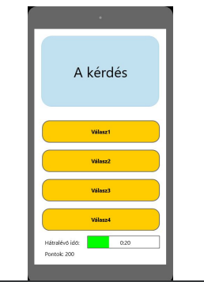

(http://aries.ektf.hu/~tajti/rft-afp/AFP_v2.pdf)

## Funkcionális Specifikáció

## 1. Overview
This website is an official website for Annales Mathematicae et
Informaticae, which is an international journal of
the Institute of Mathematics and Informatics of
Eszterházy Károly University (Eger, Hungary), published
by Líceum University Press. This journal is open for
scientific publications in mathematics and computer
science, where the field of number theory, group theory,
constructive and computer aided geometry as well as theoretical
and practical aspects of programming languages receive particular
emphasis. Our goal is to provide our users with a convenient platform.
They will have the access to publish the work on out website. Every user
will have their own account, and they can submit and view their articles
via a very beautiful UI. Everything is free, and everyone will be able to publish
articles. we welcome good articles about mathematics and computer science
as lone as they are new and unpublished.

## 2. Jelenlegi helyzet
● Kifejti, hogy miért van szükség az adott alkalmazásra, de itt már
nem a kifejtés mértéke és részletessége a fontos, hanem a
lényegretörő, vázlatos, egyértelmű leírása.
● Példa: “A megrendelő szeretné kibővíteni az általa nyújtott oktatási
szolgáltatások elérhetőségét, hogy versenytársaihoz képest így
jusson piaci előnyökhöz. Egy új rendszer előállítását rendelte meg,
amely interneten keresztül modern megoldásokat használva
működik. A rendszer segítséget nyújt azok számára, akik valamilyen
módon szeretnék tudásukat elmélyíteni egy adott területen, vagy új
ismereteket szeretnének szerezni. A XXI. század megköveteli, hogy
mindez hálózaton is elérhető legyen, ennek megfelelően Android
alkalmazást és weboldalt is a megrendelő rendelkezésére kell
bocsátani. Eddig a megrendelő csak számítógépen való gyors írás
elsajátításához használt egy Stamina nevű alkalmazást. Ez a fajta
tanulás megtetszett a diákoknak, és a tanárok is felismerték, hogy
egy játékos oktatóprogrammal eredményesebbé, szórakoztatóbbá
tehetik az oktatást, mint a hagyományos, táblára írásos módszerrel.
Ezért elkezdtek keresni számukra megfelelő, létező programokat.
Találtak többet is (pl.:Kahoot), viszont ezek nem tetszettek nekik. Egy
olyan programra lenne szükségük, amellyel a diákok önállóan tudnak
feladatot megoldani, és a többi játékos pontszámához képest tudják
viszonyítani magukat. Mindezek mellet a megrendelőnek szüksége
van a saját logojuk feltüntetésére is. Ezen okokból kifolyólag
megkértek minket, hogy csináljuk meg nekik a vágyott alkalmazást,
ami sokkal könnyebbé teheti számukra az oktatást.”

## 3. Követelménylista
● Itt kell leírni azt, hogy milyen funkciókkal kell rendelkeznie a
programunknak, ezeknek milyen al-funkciói vannak. A követelmény
specifikációhoz képest itt sokkal részletesebben és pontosabban le
vannak írva a követelmények.
● Példa:
Modul ID Név v. Kifejtés
Jogosultság K1 Bejelentkezési
felület 1.0
A felhasználó az email címe és a jelszava
segítségével bejelentkezhet.
Ha a megadott email cím vagy jelszó nem
megfelelő, akkor a felhasználó hibaüzenetet kap.
Jogosultság K2 Regisztráció 1.0
A felhasználó a felhasználói nevének, email
címének és jelszavának megadásával regisztrálja
magát.
A jelszó tárolása kódolva történik az adatbázisban.
Ha valamelyik adat ezek közül hiányzik vagy nem
felel meg a követelményeknek,
akkor a rendszer értesíti erről a felhasználót.
Jogosultság K3 Jogosultsági szintek 1.0
- Admin : új feladat feltöltése
- Felhasználó : feladatok kitöltése, toplista
megtekintése, jelszó módosítása
- Vendég : regisztráció, belépés
Modifikáció K4 Felhasználó
módosítása 1.0
A felhasználó módosítani tudja saját
Felhasználónevét. Ehhez szükséges a régi és az új
felhasználók megadása, az új megerősítése,
valamint a felhasználó jelszavának megadása.
Modifikáció K5 Jelszó módosítása 1.0
A felhasználó módosítani tudja saját jelszavát.
Ehhez szükséges a régi és az új jelszavának
megadása, valamint az új megerősítése.
Modifikáció K6
Elfelejtett
felhasználónév /
jelszó
1.0
Ha a felhasználó elfelejtette a felhasználónevét,
vagy jelszavát akkor ezzel az opcióval egy
Adminhoz tud fordulni.
Feladattípus K7 Kvíz 1.0
Több kérdésből áll, a feladat a helyes válasz
kiválasztása több lehetőség közül. A felhasználó
az eltelt idő függvényében pontot kap.
Feladattípus K8 Teszt 1.0
A teszthez hasonló, ugyanolyan több kérdésből
álló feladatsor, ahol az idő számít. A kapott
pontszám alapján érdemjegyet kap a felhasználó.
Statisztika K9 Toplista 1.0 Egy lista a játékosok pontszámairól, a lista elején
a legtöbb pontot elért felhasználó található.
Felület K10 Üzenetek 1.0 A felhasználók egymást között tudnak küldeni
üzeneteket, jogosultságuktól függően.
Felület K11 Órarend 1.0
A felhasználóknak, szerepkörtől függően, van egy
órarendje, ahol láthatják, melyik órák, mikor hol
lesznek.
Felület K12 Elektronikus Napló 1.0
A felhasználók itt láthatják megszerzett
érdemjegyeiket, dicséreteiket, rovásaikat.
Szerepkörtől függően mást látnak.
Felület K13 Fórum 1.0 Egy felhasználói fórum, ahol a felhasználók
tudnak érdekességekről beszélni, vitatkozni.
Jogosultság K14 Admin felület 1.0
Felület az admin fiókkal rendelkező felhasználó
számára. Tartalmaz egy felületet az új feladatok
feltöltéséhez.

## 4. Jelenlegi üzleti folyamatok modellje
Példa: “A mai világban az oktatás nem használja ki a már meglévő technológiákat
arra, hogy a tanulást sokkal szórakoztatóbbá és interaktívabbá tegye.
A jelenlegi világban a fiatalok egyre kevésbé hajlandóak a
"klasszikus" módon tanulni, ezért a különböző oktatási intézmények
alternatív módszereket keresnek. Jelenleg a diákok tankönyvekből
tanulnak és papír alapon adnak számot tudásukról, amely a XXI.
században elavultnak számít. Ez rengeteg nyomdai és nyomtatási
költséget jelent. Az oktatóknak rengeteg időt elvesz az idejéből a
dolgozatok egyesével való kijavítása. Illetve a dolgozatok megírása
papíron is sokkal időigényesebb, mintha különböző alkalmazásokat
használnánk a diákok számonkérésére.”

## 5. Igényelt üzleti folyamatok modellje
● Példa: “Azért hogy egyszerűbbé tegyük a diákok és a tanárok
feladatát, létrehozunk egy programot ami a mai kornak megfelelően
helyt tud állni az elektronikai világban. A tanároknak egyszerűbb lesz
mert csak egyszer kell felvinniük a rendszerbe a feladatsort és a
helyes válaszokat is csak egyszer kell kiválasztania. Ezáltal nem kell
minden dolgozatot egyesével átvizsgálni lepontoznia és érdemjegyet
adni rá, így sokkal több időt megtakaríthat. A diákoknak is sokkal
jobb mert nem kell azon görcsölniük hogy milyen lett az eredmény
mert a teszt kitöltése után egyből megtudják az eredményt és a hibás
válaszokra is a helyes választ. Illetve tanulni is sokkal könnyebb
nekik mert csak előkeresik a az éppen feladott leckét és már
tanulhatják is és egyből ellenőrizhetik magukat. Nem kell minden
egyes könyvet külön előkeresni megkeresni a fejezetet végéig
lapozni. A szülők egyből értesülnek a dolgozatok eredményeiről.”

## 6. Használati esetek
● Ez a fejezet leírja pl. melyik felhasználó milyen funkciókat tud
használni.
● Példa: “ADMIN: Az ADMIN beléphet mindegyik más szerepkörbe,
hogy az hibamentes működését ellenőrizhesse. Az Admin(ok)
feladata a rendszer problémamentes működése. Ez egyben jár azzal,
hogy az egész rendszerhez van hozzáférésük. Az Admin(ok)nak
hozzá kell tudni férniük a felhasználók listájához, ahol mindent
átváltoztathatnak egy felhasználó profilján. Tudniuk kell a
felhasználók jogosultságait, szerepkörét, jelszavát, és
felhasználónevét módosítani. Továbbá képesnek kell lenniük arra,
hogy felhasználókat vegyenek fel rendszerbe és, hogy rakjanak le
belőle. Fontos, hogy ők is képesek feladatok létrehozni, mint a
tanárok. Képesek üzenetet küldeni az összes felhasználónak,
valamint globális üzeneteket, amelyet mindenki megkap egyszerre. A
Diák jegyeit csak ők tudják módosítani, miután a Tanár adott neki.”

## 7. Megfeleltetés, hogyan fedik le a használati esetek a
követelményeket
●

## 8. Képernyő tervek
● A képernyő tervek mutatják meg, hogy mely funkciók kerülnek
egymás mellé, melyik képernyőről mely képernyőre juthatunk.
● Példa:

## 9. Forgatókönyv
● A forgatókönyvek a rendszer egy-egy tipikus felhasználását
mutatják be. A forgatókönyvnek általában van egy célja, például egy
iktató rendszerben: Levél érkeztetése, címzett értesítése,
dokumentumtárba helyezés. A forgatókönyv bemutatja, milyen
funkciókat kell használni, milyen sorrendben a kívánt cél elérése
érdekében. Ilyen értelem egy telepítési útmutatóhoz hasonlítanak.
● Példa: “Szereplők: Futási időben három szereplő figyelhető meg. Az
első szereplő maga a futó alkalmazás. (weben/androidon)
Bejelentkezve kilehet választani a kívánt játékot. Megjelenik a timer a
segítségek, és a játékos feladat. Ezzel van interakcióban a második
szereplő, maga a felhasználó, aki kitölti a tesztet, úgy hogy az időn
ne lépjen túl, és ha szüksége van akkor igénybe veheti a segítségek
egyikét A harmadik szereplő egy web-service, ami a tesztekhez
szükséges adatokat szolgáltatja az alkalmazásnak egy adatbázisból.”

## 10.Funkció - követelmény megfeleltetés
●

## 11.Fogalomszótár
● A fogalomszótár a dokumentációban megemlített idegen esetleg
nem egyértelmű jelentésű szavak / szakszavak pontos
meghatározását írja le.
● Példa: “[web-service]:különböző programnyelveken írt és különböző
platformokon futó szoftveralkalmazások interneten keresztül történő
adatcseréjére használt vebszolgáltatások.
[multiplatform]: több környezetben futtatható alkalmazás.
[main menu]: A fő menü, amely a weboldal indulásakor megjelenik.